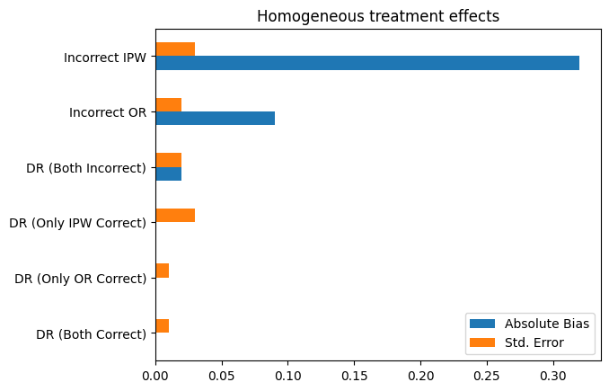
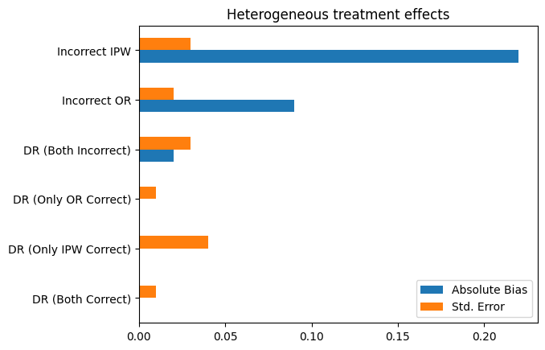

# Doubly_robust_estimator
Tutorial on Doubly Robust Estimator; theory and practice.

### Theory: [DR_estimator_theory.pdf](DR_estimator_theory.pdf)

Derives the Doubly Robust Estimator for the Average Treatment Effect by combining Outcome Regression and Inverse Probability Weighting. It proves the zero-mean augmentation, establishes double robustness (unbiased if either the propensity score is correct or both outcome models are correct), and presents the sample estimator, standard error formulas, and practical guidance on cross-fitting and overlap.

See also Seaman and Vansteelandt (2018).

### Practice: [DR_estimator.ipynb](DR_estimator.ipynb)

Monte Carlo simulation comparing Outcome Regression (OR), Inverse Probability Weighting (IPW), and Doubly Robust (DR) estimators under correct/misspecified nuisance models across homogeneous and heterogeneous Average Treatment Effects (ATE). Runs many simulations, reports absolute bias and standard error.

